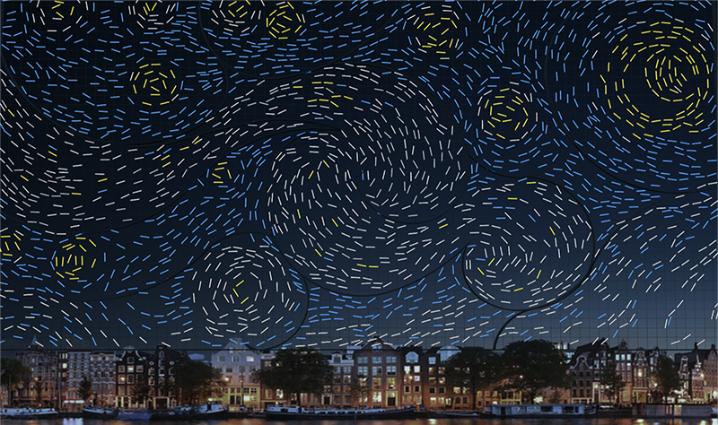
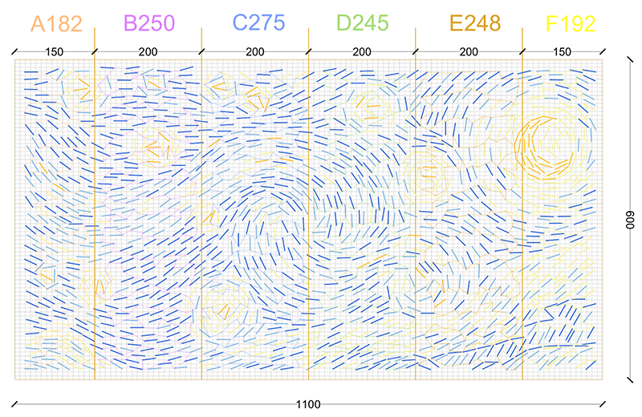
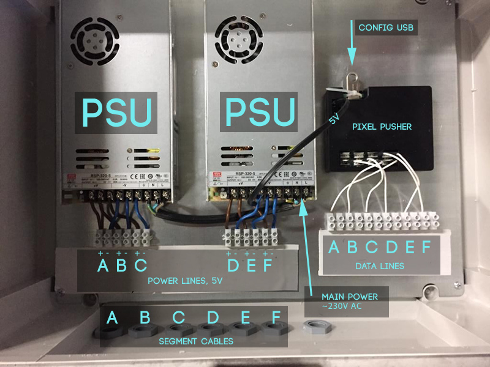
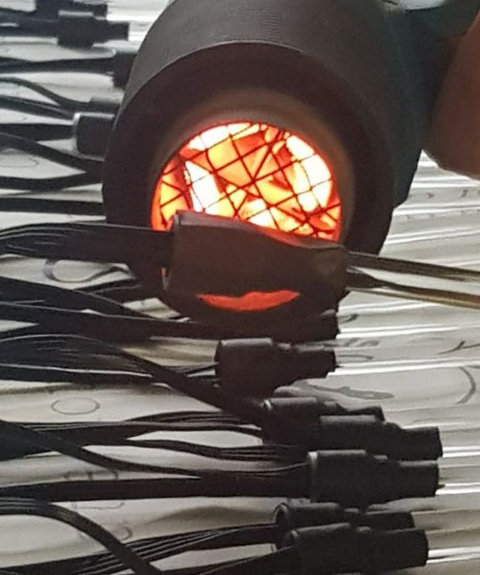
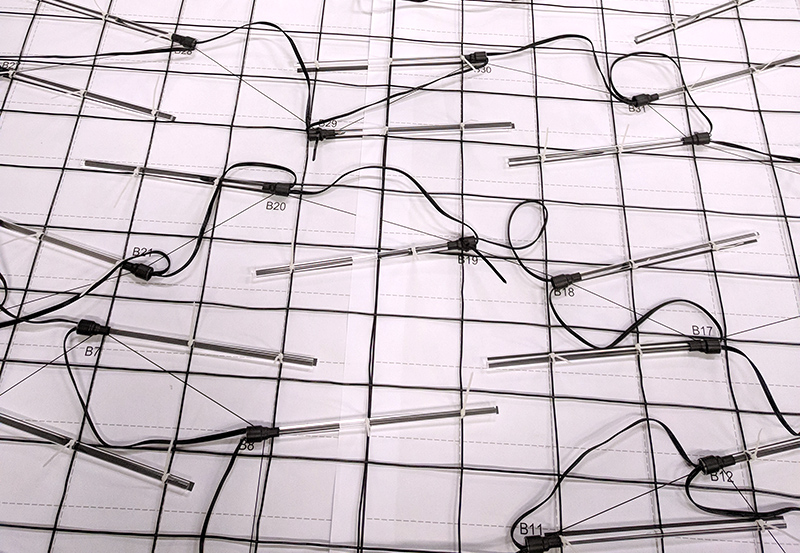
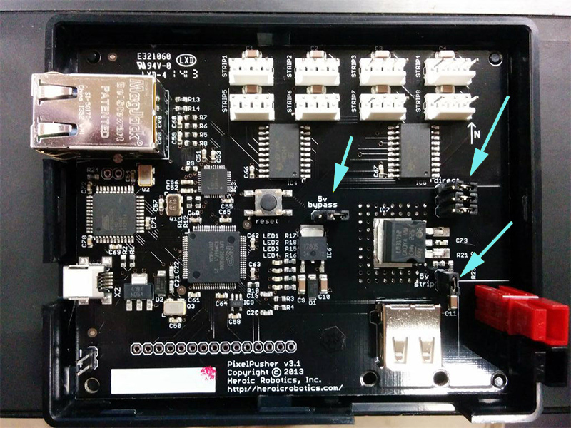
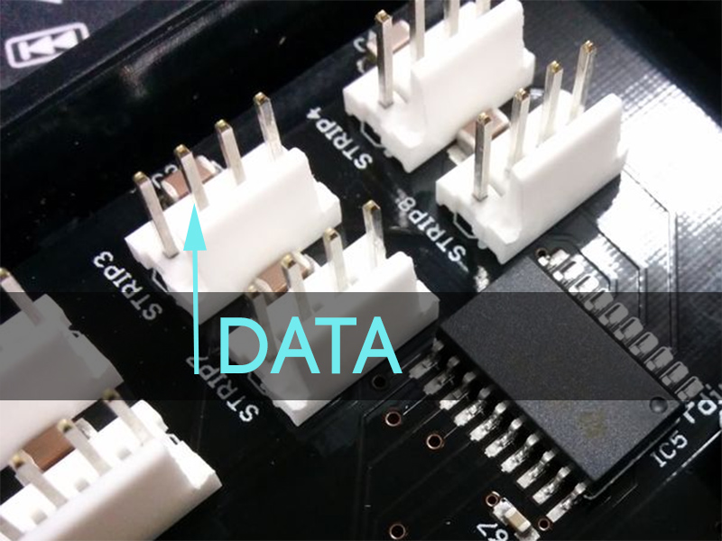

# :sparkles: ofStarryNight :sparkles:

**Starry Night** is a light installation by Pavle Petrović and Ivana Jelić.\
It premiered on the 7th edition of **Amsterdam Light Festival** [[link](https://amsterdamlightfestival.com/en/artworks/starry-night)].

This document is the technical guide on how to run it and how to make it.

## How to run it
The installation consists of six segments, each requiring its own power and data line.\
Each segment has 4 to 6 LED strings, depending on the density and placement.

Connect the **Control Box** to each segment of the installation using 2.4mm 3-wire cables. At the bottom of each segment there are small **Connection Boxes** with 3 connectors - **brown V+, blue V-, and yellow-green for data**. In the **Control Box** make sure that the data connections are in the right order (A -> F, left -> right). Follow the picture below for more info.

The USB stick in the Pixel Pusher must be FAT32 and should contain only two files, both of which are in the [docs/usb](docs/usb/) folder of this repo:
- pixel.rc - Pixel Pusher configuration
- canned.dat - Actual data for the pixels

Once all the cables are connected and the USB stick is in the Pixel Pusher the installation is ready to run:

- **Switching on the power** will light up the entire installation.
- **Switching off the power** will turn the lights and the entire system off.

## How to tweak it
Connect everything like in the previous section.\
In the **pixel.rc** file on the USB stick remove the following line:
>*canned_file=2*

Attach the Pixel Pusher to the network using the Ethernet cable.

Use **ofStarryNight** software to connect to the Pixel Pusher over the network (refer to *Software::Usage* [section](#usage)). Recommendation is to place a WiFi router [[example](https://www.tp-link.com/us/products/details/cat-5508_TL-WA850RE.html)] close to Pixel Pusher and connect them with the ethernet cable, while connecting wirelessly to the router from a laptop.

## Software

The software is used to easily describe each pixel in the installation. Each pixel can have one of four colors assigned (and black/off) and these colors can be tweaked separately. The setup can be easily modified by changing the parameters in GUI.

It is possible to connect to **Pixel Pusher** through TCP/IP for live tweaking, or to create a binary file for the standalone. This binary file is called **pixels.bin**, it should be renamed to **canned.dat** and copied to the USB stick of the **Pixel Pusher**.

### Usage
- Use the GUI to modify the setup - it should reflect the actual setup and the setting in **pixel.rc** for the Pixel Pusher.
- Context files
	- pixels.txt - text file with color indices (0 to 3 and black as 4) for each pixel
	- pixels.bin - binary file with colors for each pixel, can be used as *canned.dat* for Pixel Pusher
	- setup.xml - xml file with info from the GUI
- Mouse interaction
	- Left click selects / deselects the Pixel (*visible on the string as red pixel*)
	- Right click and drag moves the view
	- Scroll zooms in and out
	- Intuitive interaction with GUI
- Keyboard interaction
	- Arrow keys move the selection
	- Escape clears the selection
	- Numbers (1, 2, 3, 4) assign the colors
	- Delete / backspace removes the color
	- Ctrl + c (cmd + c on osx) connects to Pixel Pusher
	- Ctrl + l (cmd + l on osx) loads the context from pixels.txt
	- Ctrl + s (cmd + s on osx) saves the context to pixels.txt and pixels.bin

### Building
**ofStarryNight** is done in **openFrameworks** [[link](https://github.com/openframeworks/openFrameworks)]

- ofx addons needed (take forked):
	- **ofxAsio** [[original](https://github.com/morphogencc/ofxAsio)] [[forked](https://github.com/pavlecc/ofxAsio)]
		- (*remove **ofxAsio/libs** and **ofxAsio/src/osc** folders from the project*)
	- **ofxPixelPusher** [[original](https://github.com/morphogencc/ofxPixelPusher)] [[forked](https://github.com/pavlecc/ofxPixelPusher)]
	- **ofxGui** [*included in openFrameworks*]

- boost
	- Download additional libs [[link](https://datapacket.dl.sourceforge.net/project/boost/boost-binaries/1.64.0/boost_1_64_0-msvc-14.1-64.exe)]
	- Copy the following libs to **openFrameworks\libs\boost\lib\vs\x64**
		- libboost_date_time-vc141-mt-1_64.lib
		- libboost_date_time-vc141-mt-gd-1_64.lib
		- libboost_regex-vc141-mt-1_64.lib
		- libboost_regex-vc141-mt-gd-1_64.lib

The code is tested on Visual Studio 2017 and Xcode 9.4.1, x64 targets\
On Xcode 10.0 it also works, but you need to move the window a bit once the program starts [[bug](https://forum.openframeworks.cc/t/unable-to-load-info-plist-exceptions-egpuoverrides/30553)]

## Hardware
### Rough BOM
- 30x Strings of LEDs
	- SMD3535 RGB LED on a SM16703 chip
	- 5V, 0.3W max
	- Black wire, 28cm distance (LED to LED)
	- IP67 flat casing
	- 50 pieces per string
- 1400x Acrylic rods
	- 8mm diameter, 25cm length
	- Special kind of acrylic which is suitable for LED lighting
- 1x Pixel Pusher controller by Heroic Robotics [[link](http://www.heroicrobotics.com/products/pixelpusher)]
- 2x Mean Well SP-320-5 power supplies [[link](https://www.meanwell.com/webapp/product/search.aspx?prod=SP-320)]
- 5000 cable ties (transparent and black)
- 100m of heat shrink (various sizes, with inner glue)
- 200m of cable (various thickness)
- 70m2 of wire grid

### Preparing the rods
- Place the LED to the edge of the rod with a bit of glue from the glue gun
- Put the heat shrink around it and warm it with the heat gun
- Make sure it cools off properly and in the right place (centrally)

### Placing the rods on the grid
- Spread the 1:1 print on the table and put the grid on top
- Make sure that the vertical lines of the grid and the drawing are aligned
	- If there's a mismatch, make sure it's symmetrical
- Place the rods on the grid following the positions on the drawing
- Secure them with cable ties

### Power cables
- Due to the length of LED strings, each string should get the power at the beginning and at the end
- The first and each even string (1st, 2nd, 4th, 6th) should get the power directly from the PSU. The end of the last string is not an exception.
- All the connectors should be soldered so that the cables come in from one side and the connection is facing the sky.
	- In a later process this will be secured from water with heat-shrinks

### Pixel Pusher
- All the jumpers on the Pixel Pusher should be on (connecting)

- Only the data line is used from strips connectors, that's the second pin

- The Pixel Pusher runs on 5V, the same voltage as LEDs

### Control Box
- The main power supply (~230V AC) goes to the right PSU
- Each of the installation segments is connected to the Control Box by a 3-wire cable: brown V+, blue V- and yellow-green for data. V+ and V- connectors are close to power supplies, while data is close to Pixel Pusher
- The order of data cables is really important, since each of 6 outputs from Pixel Pusher is mapped to their installation segment
- For more details follow *How to run it* [section](#how-to-run-it)

## Weak spots / Things to remember
- The system is very sensitive to voltage drops, that's why the power cables reach out to each end of the LED strings; 2.4mm cables needed to connect the Control Box to each segment.
- On several places the connections between strings remained horizontal due to strained wires, we've protected the connectors and glued the entry points, but there's a risk of water going in.
- LEDs A151-A182 are in reverse order compared to the original setup
- LED E210 was removed and rest of the string was moved sequentially.